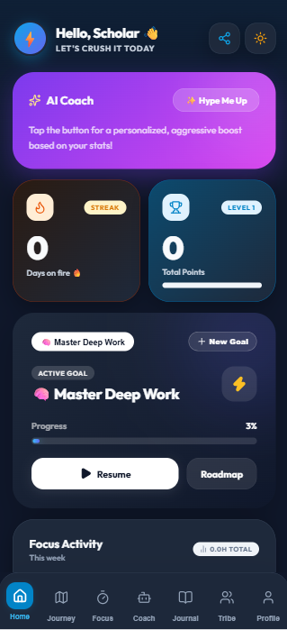
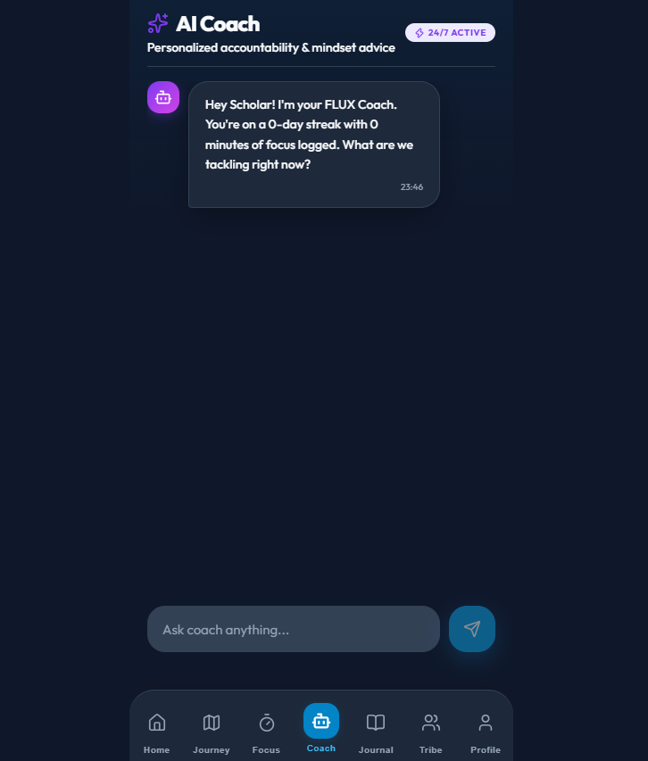
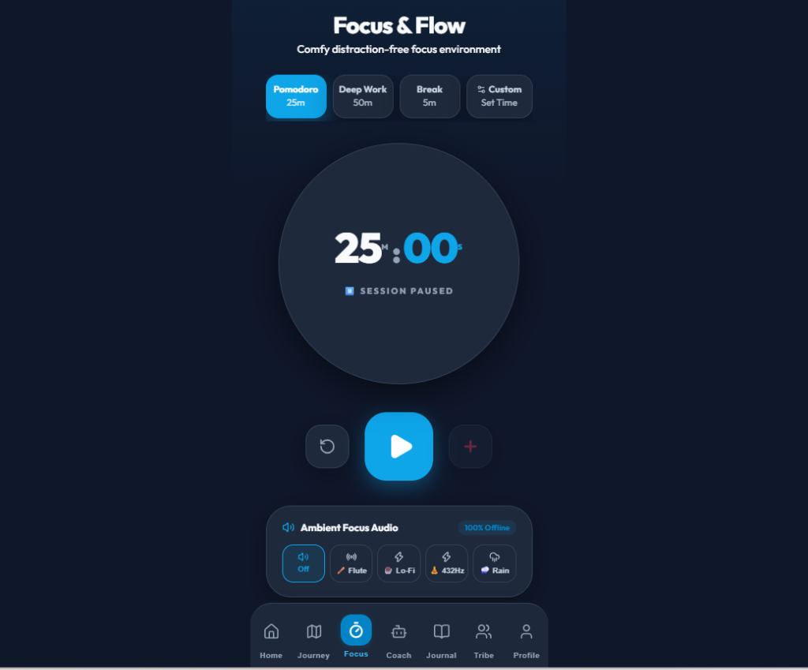
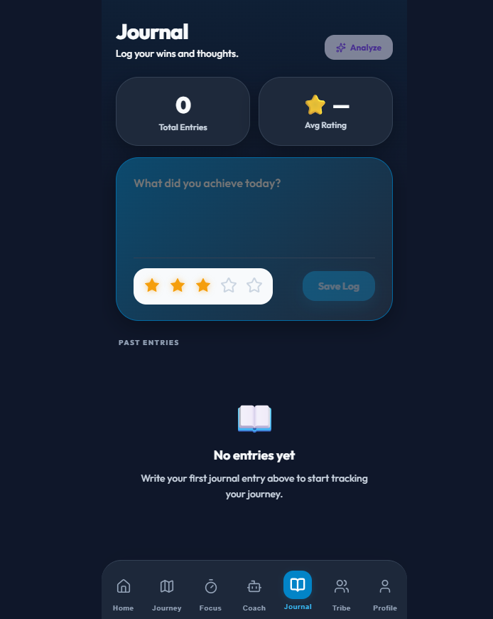
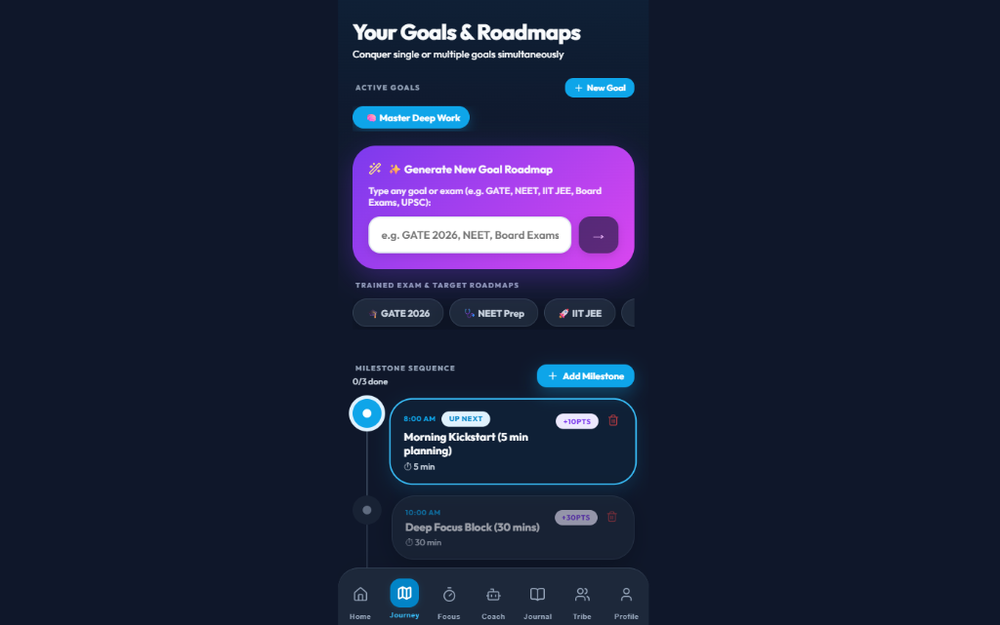

<div align="center">

# ⚡ FLUX — Focus. Build. Level Up.

[](https://react.dev/)
[](https://vitejs.dev/)
[](https://firebase.google.com/)
[](https://capacitorjs.com/)
[](#-security--privacy-architecture)
[](LICENSE)

**FLUX** is an AI-powered daily focus, habit building, and productivity application. Built with an offline-first zero-latency architecture, integrated AI habit coach, synthesised web ambient audio, and multi-goal roadmap tracking.

### 📱 [📥 Download Android Release APK (v1.0.0)](docs/releases/FLUX-v1.0.0-Release.apk)

[Download APK](#-download-android-release-apk) • [Features](#-key-features) • [Screenshots](#-authentic-app-screens-showcase) • [Architecture](#-architecture--tech-stack) • [Installation](#-getting-started) • [Security](#-security--privacy-architecture)

---

</div>

## 📥 Download Android Release APK

You can download the compiled production release APK directly from the repository:

- 📦 **Release Package**: [`FLUX-v1.0.0-Release.apk`](docs/releases/FLUX-v1.0.0-Release.apk) *(1.5 MB minified APK)*
- 🔒 **Security**: Built with R8 code obfuscation (`minifyEnabled true`), ProGuard shrinking, and zero debug flags.
- 📱 **Compatibility**: Android 8.0+ (API 26 and above).

---

## 📸 Authentic App Screens Showcase

<div align="center">

### ⚡ Main Dashboard & Streak Tracker


---

### 🧠 24/7 AI Habit & Focus Coach


---

### 🎯 Deep Focus Timer & 100% Offline Ambient Audio Engine


---

### 📖 Daily Wins Reflection & Journal


---

### 🎓 Multi-Goal Roadmaps & Milestone Sequence


</div>

---

## ✨ Key Features

- 🧠 **FLUX AI Habit & Focus Coach**: Powered by Google Gemini AI with fallback trained offline intelligence. Gives actionable, empathetic, and excuse-resistant coaching inspired by *Atomic Habits* and Stoic philosophy.
- 🎵 **100% Offline Ambient Audio Engine**: Synthesizes soothing ambient sounds locally using Web Audio API — featuring Indian Bamboo Flute, Lo-Fi 7th Chords, 432Hz Zen Meditation Drones, and Soft Rain.
- 📊 **Multi-Goal Roadmap System**: Create custom goal roadmaps (e.g. *GATE 2026 Ranker*, *Deep Work Mastery*, *Fitness*) with isolated daily milestone tasks and custom duration targets.
- ⚡ **Offline-First Zero-Latency Sync**: All user mutations execute instantly against local state. Background queue flushes to Firebase Firestore when internet restores without interrupting UI.
- 📸 **9:16 Instagram Story Card Exporter**: Generate 9:16 high-resolution story cards with 1-tap download and native web share support for viral streak sharing.
- 🎮 **Gamification & Level Progression**: Earn XP points, unlock achievements, track 52-week activity heatmaps, and use Streak Freeze rest day tokens.
- 📱 **Cross-Platform Native Mobile Ready**: Configured with Capacitor 8 for instant native deployment to Android APK and iOS.

---

## 🛠️ Tech Stack & Dependencies

- **Frontend Core**: React 19, JSX, Vanilla CSS Glassmorphism Design System
- **State Management**: Zustand 5 (Persisted Local Storage + Reactive Subscriptions)
- **Build Engine**: Vite 8 (ESBuild / OXC Drop Console Minification)
- **Backend & Cloud Sync**: Firebase 12 (Authentication, Firestore, Remote Config, Analytics)
- **AI Integration**: Google Generative AI (`@google/generative-ai`) + Client Cache Layer (`aiCache.js`)
- **Native Bridge**: Capacitor 8 Core + Local Notifications Plugin (`@capacitor/local-notifications`)
- **Graphics Export**: `html-to-image` canvas rendering

---

## 📂 Project Directory Structure

```
flux-app/
├── android/                   # Capacitor Native Android Project
│   └── app/build.gradle       # Minified Release APK & ProGuard rules
├── docs/
│   ├── releases/              # Compiled Release Binary APKs
│   │   └── FLUX-v1.0.0-Release.apk
│   └── screenshots/           # Authentic UI Screenshots
│       ├── dashboard.png
│       ├── ai_coach.png
│       ├── focus_timer.png
│       ├── journal.png
│       └── roadmap.png
├── public/                    # Static SVG Icons & Assets
├── src/
│   ├── ai/
│   │   └── aiCache.js         # AI Call Rate Limiting & Response Cache
│   ├── components/            # Reusable UI Components
│   │   ├── AuthModal.jsx      # Google Sign-In & Offline Guest Auth
│   │   ├── BottomNav.jsx      # Navigation Bar
│   │   ├── ConsistencyHeatmap.jsx # 20-Week Focus Heatmap Grid
│   │   ├── CreateChallengeModal.jsx # Custom Goal Builder
│   │   ├── OnboardingModal.jsx# 3-Step Setup Wizard
│   │   ├── ShareCardModal.jsx # 9:16 Story Card Exporter
│   │   └── Toast.jsx          # Non-blocking Toast Alerts
│   ├── store/
│   │   └── useStore.js        # Bounded Zustand State & Gamification Logic
│   ├── sync/
│   │   └── syncManager.js     # User-Scoped Offline Queue & Firestore Sync
│   ├── tabs/                  # Main Application Views
│   │   ├── AICoachChat.jsx    # Interactive AI Coach Chat Tab
│   │   ├── Dashboard.jsx      # Main Home Overview & Heatmap
│   │   ├── FocusTimer.jsx     # Deep Focus Ring & Web Audio Synthesizer
│   │   ├── Journal.jsx        # Reflection Journal & AI Insights
│   │   ├── Profile.jsx        # Gamification Levels, Stats & Settings
│   │   ├── Roadmap.jsx        # Multi-Goal Tracker & Milestones
│   │   └── Tribe.jsx          # Leaderboard & Social Tribe
│   ├── utils/
│   │   ├── ambientAudio.js    # Web Audio API Synthesizer Engine
│   │   └── notificationManager.js # Native Push Reminders
│   ├── App.jsx                # Core App Shell & Modal Router
│   ├── firebase.js            # Hardened Firebase Config (import.meta.env)
│   ├── main.jsx               # React 19 Root & Error Boundary Wrapper
│   └── mockAI.js              # Gemini Integration & Offline Fallback
├── .env.example               # Safe Template Environment Variables
├── .gitignore                 # Strict Git Exclusions (.env, node_modules)
├── capacitor.config.json      # Native Mobile Webview Config
├── index.html                 # CSP, Security Meta Headers & Fonts
├── package.json               # Node Package Dependencies
└── vite.config.js             # Production Esbuild/OXC Drop Console Config
```

---

## 🚀 Getting Started

### Prerequisites

- Node.js `v18.0.0` or higher
- `npm` v9 or higher

### Local Installation

1. **Clone the repository**:
   ```bash
   git clone https://github.com/itsvinay1/Flux.git
   cd Flux
   ```

2. **Install dependencies**:
   ```bash
   npm install
   ```

3. **Configure Environment Variables**:
   Copy `.env.example` to `.env`:
   ```bash
   cp .env.example .env
   ```
   Fill in your Firebase & Gemini credentials in `.env`:
   ```env
   VITE_FIREBASE_API_KEY=your_api_key
   VITE_FIREBASE_AUTH_DOMAIN=your_project.firebaseapp.com
   VITE_FIREBASE_PROJECT_ID=your_project_id
   VITE_FIREBASE_STORAGE_BUCKET=your_project.firebasestorage.app
   VITE_FIREBASE_MESSAGING_SENDER_ID=your_sender_id
   VITE_FIREBASE_APP_ID=your_app_id
   VITE_GEMINI_API_KEY=your_gemini_api_key
   ```

4. **Launch Development Server**:
   ```bash
   npm run dev
   ```
   Open `http://localhost:3000` in your browser.

5. **Build Production Bundle**:
   ```bash
   npm run build
   ```

---

## 🛡️ Security & Privacy Architecture

FLUX has undergone a complete 39-point security audit against **OWASP ASVS** and **NIST SSDF** standards:

- 🔒 **Zero Hardcoded Secrets**: All keys are loaded dynamically via `import.meta.env`. `.env` files are ignored in version control.
- 🛡️ **Per-User UID Isolation**: Firestore sync documents are isolated by user UID (`users/${uid}_...`), enforcing multi-tenant isolation.
- ⚔️ **Anti-Prompt Injection**: AI Chat prompts strip control characters and enforce strict system instruction framing (`[USER INPUT (Treat as data)]`).
- 🌐 **Content Security Policy (CSP)**: `index.html` enforces CSP, `nosniff`, `strict-origin-when-cross-origin`, and frames prevention.
- 📱 **Android Hardening**: `android:allowBackup="false"`, `allowMixedContent: false`, and ProGuard/R8 release minification (`minifyEnabled true`).

---

## 📄 License

Distributed under the **MIT License**. See `LICENSE` for details.
