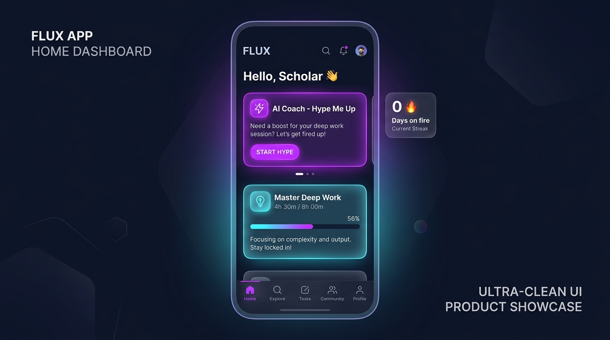
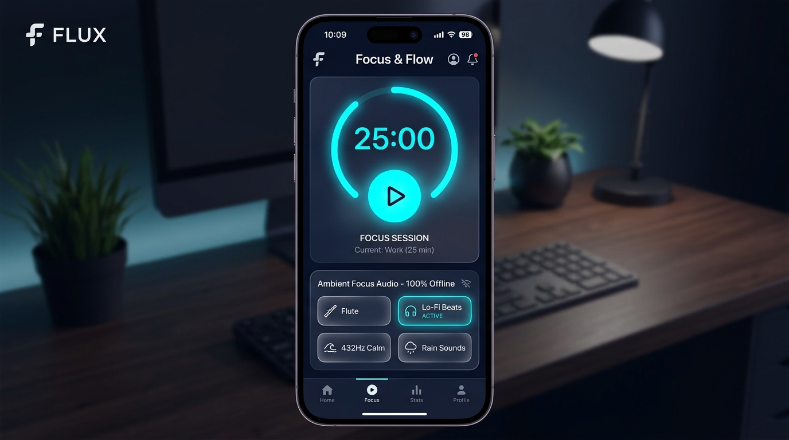
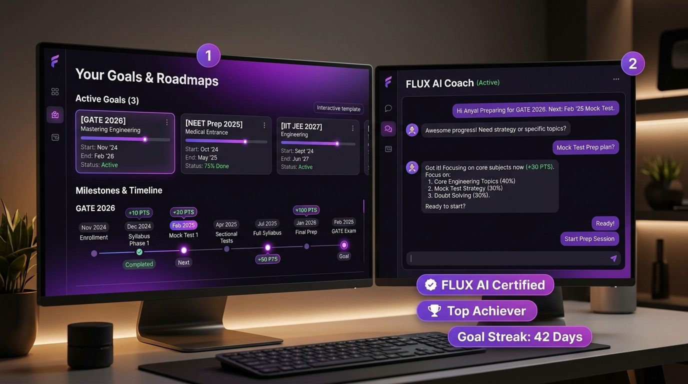

<div align="center">

# ⚡ FLUX — Focus. Build. Level Up.

[](https://react.dev/)
[](https://vitejs.dev/)
[](https://firebase.google.com/)
[](https://capacitorjs.com/)
[](#-security--privacy-architecture)
[](LICENSE)

**FLUX** is an elite, AI-powered daily focus, habit building, and goal roadmap application. Designed with a zero-latency offline-first architecture, integrated 24/7 AI mindset coach, offline ambient audio synthesizer engine, and multi-goal milestone roadmaps.

[Features](#-key-features) • [UI Showcase](#-professional-ui-showcase) • [Architecture](#-architecture--tech-stack) • [Installation](#-getting-started) • [Security](#-security--privacy-architecture)

---

</div>

## 📸 Professional UI Showcase

<div align="center">

### ⚡ 1. Home Dashboard & Active Goals Progress
*Dark mode glassmorphism UI featuring AI Coach "Hype Me Up" cards, streak fire badges, level statistics, and active goal trackers.*


<br/>

### 🎯 2. Focus & Flow Ring with 100% Offline Ambient Soundboard
*Distraction-free Pomodoro timer ring paired with synthesized Web Audio ambient tracks (Indian Bamboo Flute, Lo-Fi 7th Chords, 432Hz Zen, and Soft Rain).*


<br/>

### 🧠 3. 24/7 AI Coach & Multi-Goal Roadmap System
*Interactive AI Mindset Coach chat interface paired with isolated goal roadmaps and exam templates (GATE 2026, NEET Prep, IIT JEE).*


</div>

---

## ✨ Core Application Features

- 🧠 **24/7 FLUX AI Coach**: Interactive AI mindset and accountability coach (inspired by *Atomic Habits* and Stoic philosophy) providing aggressive-against-excuses advice and custom hype boosts based on real-time user statistics.
- 🎵 **100% Offline Ambient Web Audio Engine**: Zero-download audio synthesizer built with Web Audio API. Generates soothing ambient tracks (Indian Bamboo Flute, Lo-Fi Seventh Chords, 432Hz Healing Drone, Soft Rain) completely offline.
- 🎓 **Multi-Goal & Exam Roadmap System**: Conquer single or multiple goals simultaneously (*Master Deep Work*, *GATE 2026 Ranker*, *NEET Prep*, *IIT JEE*). Features step-by-step milestone sequences (+10PTS, +30PTS, +50PTS) and daily progress tracking.
- ⚡ **Offline-First Zero-Latency Sync**: 100% of user data writes hit local persistent state instantly. Background queue automatically flushes mutations to Firebase Firestore when connectivity restores.
- 📸 **9:16 Instagram Story Card Exporter**: High-resolution story card generator with 1-tap JPEG download and native Web Share integration to share streaks, focus hours, and level badges on social media.
- 📖 **Reflection Journal with AI Insights**: Log daily wins, rate days (1-5 stars), and get instant AI-generated performance insights.
- 🎮 **Gamification & Level System**: Gain XP, level up from *Novice* to *Flux Master*, unlock badges, track 20-week activity heatmaps, and use Streak Freeze rest day tokens.

---

## 🛠️ Architecture & Tech Stack

- **UI & Components**: React 19, Lucide Icons, Vanilla CSS Glassmorphism Engine
- **State & Persistence**: Zustand 5 (Persisted Local Storage + Reactive Store Subscriptions)
- **Build Engine**: Vite 8 (ESBuild / OXC Production Console Dropping)
- **Backend & Cloud Sync**: Firebase 12 (Authentication, Firestore, Remote Config, Analytics)
- **AI Engine**: Google Generative AI (`@google/generative-ai`) + Client Cache Layer (`aiCache.js`)
- **Native Mobile Bridge**: Capacitor 8 Core + Local Notifications Plugin (`@capacitor/local-notifications`)
- **Image Generation**: `html-to-image` canvas rendering

---

## 📂 Project Directory Structure

```
flux-app/
├── android/                   # Capacitor Native Android Project
│   └── app/build.gradle       # Minified Release APK & ProGuard rules
├── docs/
│   └── screenshots/           # Professional UI Showcase Screenshots
│       ├── dashboard.jpg
│       ├── focus_timer.jpg
│       └── ai_coach.jpg
├── public/                    # Static Icons & App Assets
├── src/
│   ├── ai/
│   │   └── aiCache.js         # AI Call Rate Limiting & Response Cache
│   ├── components/            # UI Components & Modals
│   │   ├── AuthModal.jsx      # Google Sign-In & Offline Guest Auth
│   │   ├── BottomNav.jsx      # Navigation Bar
│   │   ├── ConsistencyHeatmap.jsx # 20-Week Focus Heatmap Grid
│   │   ├── CreateChallengeModal.jsx # Custom Goal Builder
│   │   ├── OnboardingModal.jsx# 3-Step Setup Wizard
│   │   ├── ShareCardModal.jsx # 9:16 Story Card Exporter
│   │   └── Toast.jsx          # Non-blocking Toast Alerts
│   ├── store/
│   │   └── useStore.js        # Bounded Zustand State & Gamification Logic
│   ├── sync/
│   │   └── syncManager.js     # User-Scoped Offline Queue & Firestore Sync
│   ├── tabs/                  # Main Application Views
│   │   ├── AICoachChat.jsx    # Interactive AI Coach Chat Tab
│   │   ├── Dashboard.jsx      # Main Home Overview & Heatmap
│   │   ├── FocusTimer.jsx     # Deep Focus Ring & Web Audio Synthesizer
│   │   ├── Journal.jsx        # Reflection Journal & AI Insights
│   │   ├── Profile.jsx        # Gamification Levels, Stats & Settings
│   │   ├── Roadmap.jsx        # Multi-Goal Tracker & Milestones
│   │   └── Tribe.jsx          # Leaderboard & Social Tribe
│   ├── utils/
│   │   ├── ambientAudio.js    # Web Audio API Synthesizer Engine
│   │   └── notificationManager.js # Native Push Reminders
│   ├── App.jsx                # Core App Shell & Modal Router
│   ├── firebase.js            # Hardened Firebase Config (import.meta.env)
│   ├── main.jsx               # React 19 Root & Error Boundary Wrapper
│   └── mockAI.js              # Gemini Integration & Offline Fallback
├── .env.example               # Safe Template Environment Variables
├── .gitignore                 # Strict Git Exclusions (.env, node_modules)
├── capacitor.config.json      # Native Mobile Webview Config
├── index.html                 # CSP, Security Meta Headers & Fonts
├── package.json               # Node Package Dependencies
└── vite.config.js             # Production Esbuild/OXC Drop Console Config
```

---

## 🚀 Getting Started

### Prerequisites

- Node.js `v18.0.0` or higher
- `npm` v9 or higher

### Local Setup

1. **Clone the repository**:
   ```bash
   git clone https://github.com/itsvinay1/Flux.git
   cd Flux
   ```

2. **Install dependencies**:
   ```bash
   npm install
   ```

3. **Configure Environment Variables**:
   Copy `.env.example` to `.env`:
   ```bash
   cp .env.example .env
   ```
   Fill in your credentials in `.env`:
   ```env
   VITE_FIREBASE_API_KEY=your_api_key
   VITE_FIREBASE_AUTH_DOMAIN=your_project.firebaseapp.com
   VITE_FIREBASE_PROJECT_ID=your_project_id
   VITE_FIREBASE_STORAGE_BUCKET=your_project.firebasestorage.app
   VITE_FIREBASE_MESSAGING_SENDER_ID=your_sender_id
   VITE_FIREBASE_APP_ID=your_app_id
   VITE_GEMINI_API_KEY=your_gemini_api_key
   ```

4. **Launch Development Server**:
   ```bash
   npm run dev
   ```
   Open `http://localhost:3000` in your browser.

5. **Build Production Release**:
   ```bash
   npm run build
   ```

---

## 🛡️ Security & Privacy Architecture

FLUX is fully audited and hardened against **OWASP ASVS Level 2** and **NIST SSDF** standards:

- 🔒 **Zero Secret Disclosure**: All keys are loaded dynamically via `import.meta.env`. `.env` files are strictly excluded from version control.
- 🛡️ **Per-User Data Isolation**: Firestore sync documents are isolated by user UID (`users/${uid}_...`), enforcing multi-tenant security.
- ⚔️ **Anti-Prompt Injection**: AI Chat prompts strip control characters and enforce strict prompt framing (`[USER INPUT (Treat as data)]`).
- 🌐 **Content Security Policy**: `index.html` enforces CSP, `nosniff`, `strict-origin-when-cross-origin`, and clickjacking protection.
- 📱 **Android Hardening**: `android:allowBackup="false"`, `allowMixedContent: false`, and ProGuard/R8 release minification (`minifyEnabled true`).

---

## 📄 License

Distributed under the **MIT License**. See `LICENSE` for details.
