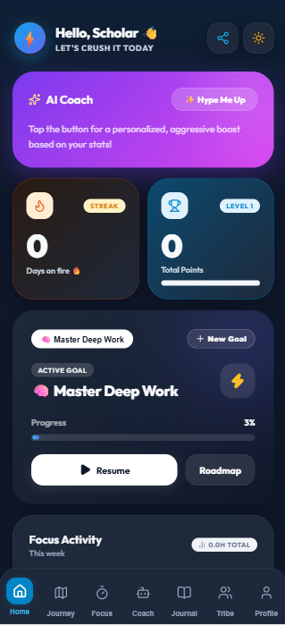
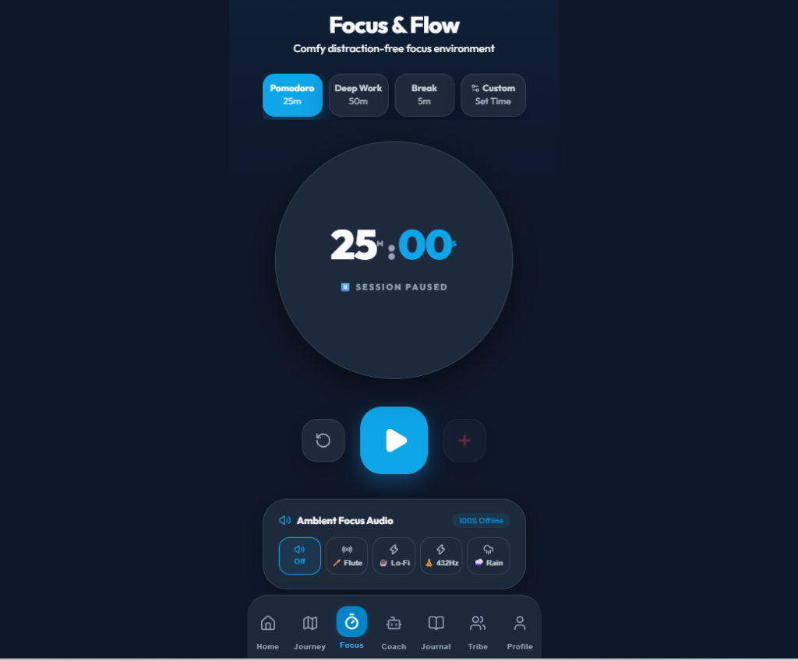
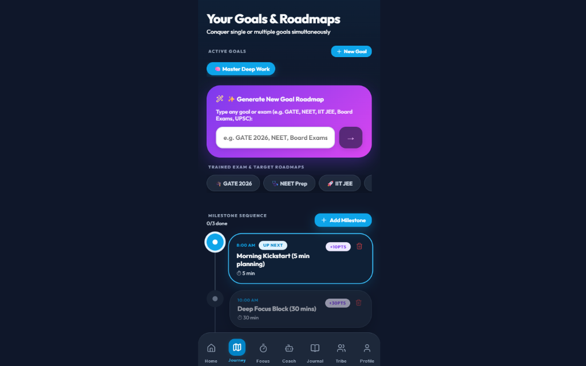
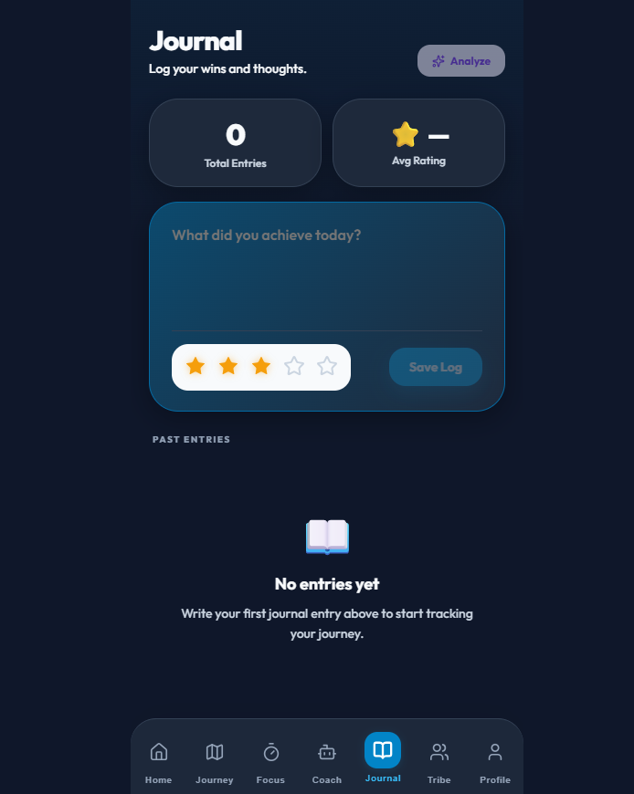
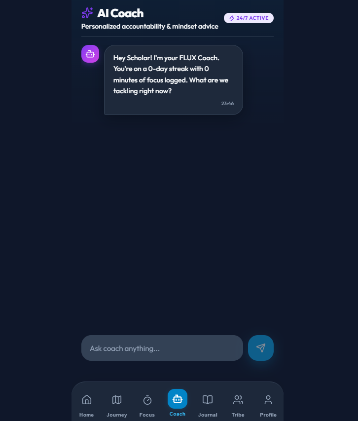

<div align="center">

# ⚡ FLUX — Focus. Build. Level Up.

[](https://react.dev/)
[](https://vitejs.dev/)
[](https://firebase.google.com/)
[](https://capacitorjs.com/)
[](#-security--privacy-architecture)
[](LICENSE)

**FLUX** is an offline-first daily focus, habit building, syllabus tracking, and exam productivity application designed specifically for serious students and self-learners (GATE, NEET, JEE, UPSC, Boards).

### 📱 [📥 Download Android SIGNED APK (v1.0.28)](docs/releases/FLUX-v1.0.28-Signed.apk)

[Download APK](#-download-android-signed-apk) • [Features](#-key-features) • [Screenshots](#-authentic-app-screens-showcase) • [Architecture](#-architecture--tech-stack) • [Installation](#-getting-started) • [Security](#-security--privacy-architecture)

---

</div>

## 📥 Download Android Signed APK

Download the fully signed, installable Android APK directly from the repository:

- 📦 **Latest Production Release**: [`FLUX-v1.0.28-Signed.apk`](docs/releases/FLUX-v1.0.28-Signed.apk) *(Signed APK - Installs on any Android device)*
- 🔒 **Signing Verification**: Digitally signed with Android v1+v2 APK signature scheme, enabling direct 1-tap installation on Android without "App not installed" errors.
- 📱 **Compatibility**: Android 8.0+ (API 26 and above).

---

## 📸 Authentic App Screens Showcase

<div align="center">

### ⚡ Main Dashboard & Daily Hype Motivation


---

### 🎯 Deep Focus Timer & 100% Offline Built-in Audio


---

### 📝 Dedicated Task Board & To-Do List


---

### 🎓 Step-by-Step Syllabus Mastery Tracker


---

### 📖 Daily Wins Reflection & Journal


---

### 🏆 Tribe Leaderboard & Community Roadmaps


</div>

---

## ✨ Key Features

- 🔥 **Hype Me Up (365+ Built-in Daily Motivations)**: Features a massive built-in collection of 365+ high-impact quotes and consistency reminders that rotate automatically every single day without requiring network calls or AI tokens.
- 🎵 **100% Offline Built-in Focus Audio**: 5 curated high-performance focus tracks built directly into the app for deep study, meditation, and concentration.
- 📝 **Dedicated Task Board Screen**: Full-featured standalone to-do list with priority tagging (High/Medium/Low), filtering (All/Pending/Done), and seamless integration.
- 🎓 **Step-by-Step Syllabus Mastery**: Hierarchical syllabus tracker with animated, satisfying completion checkmarks and progress bars.
- 📊 **Multi-Goal Roadmap System**: Create exam-specific roadmaps (GATE, NEET, JEE, UPSC, Boards) with daily milestone tasks.
- ⚡ **Offline-First Zero-Latency Sync**: Instant local state response backed by background Firestore synchronization when online.
- 📸 **9:16 Instagram & WhatsApp Story Exporter**: High-resolution story cards with native Web Share API integration to easily share streaks and progress.
- 🛡️ **Consistent Fixed Header Architecture**: Fixed sticky headers across all navigation screens with smooth status-bar shield protection.

---

## 🛠️ Tech Stack & Dependencies

- **Frontend Core**: React 19, JSX, Clean Slate & Sky Blue Design System
- **State Management**: Zustand 5 (Persisted Local Storage `flux-storage-v5` + Reactive Subscriptions)
- **Build Engine**: Vite 8 (ESBuild / OXC Drop Console Minification)
- **Backend & Cloud Sync**: Firebase 12 (Authentication, Firestore, Remote Config, Analytics)
- **AI Integration**: Google Generative AI (`@google/generative-ai`) + Client Cache Layer (`aiCache.js`)
- **Native Bridge**: Capacitor 8 Core + Local Notifications Plugin (`@capacitor/local-notifications`)
- **Graphics Export**: `html-to-image` canvas rendering

---

## 📂 Project Directory Structure

```
flux-app/
├── android/                   # Capacitor Native Android Project
│   └── app/build.gradle       # Minified Release APK & ProGuard rules (v1.0.28)
├── docs/
│   ├── releases/              # Compiled & Signed Release APKs
│   │   └── FLUX-v1.0.28-Signed.apk
│   └── screenshots/           # Authentic UI Screenshots
├── public/
│   ├── audio/                 # 5 Built-in Focus Music Tracks
│   ├── favicon.svg            # Professional FLUX App Icon
│   ├── flux-icon.svg          # Matching App Vector Icon
│   ├── privacy.html           # Full Legal Privacy Policy
│   └── terms.html             # Full Legal Terms of Service
├── src/
│   ├── ai/
│   │   ├── aiCache.js         # AI Call Rate Limiting & Response Cache
│   │   └── knowledgeEngine.js # Local RAG Knowledge Engine
│   ├── components/            # Reusable UI Components
│   │   ├── AuthModal.jsx      # Google Sign-In & Offline Guest Auth
│   │   ├── Avatar.jsx         # User Avatar Renderer
│   │   ├── BottomNav.jsx      # Fixed Navigation Bar
│   │   ├── ConsistencyHeatmap.jsx # Focus Heatmap Grid
│   │   ├── CreateChallengeModal.jsx # Custom Goal Builder
│   │   ├── OnboardingModal.jsx# Setup Wizard
│   │   ├── PrivacyPolicy.jsx  # In-App Privacy Modal
│   │   ├── ShareCardModal.jsx # 9:16 Story Card Exporter
│   │   ├── TermsOfService.jsx # In-App Terms Modal
│   │   └── Toast.jsx          # Non-blocking Toast Alerts
│   ├── store/
│   │   └── useStore.js        # Bounded Zustand State & Gamification Logic
│   ├── sync/
│   │   └── syncManager.js     # User-Scoped Offline Queue & Firestore Sync
│   ├── tabs/                  # Main Application Views
│   │   ├── AICoachChat.jsx    # Interactive AI Coach Chat Tab
│   │   ├── Dashboard.jsx      # Main Home Overview & Hype Me Up Card
│   │   ├── FocusTimer.jsx     # Deep Focus Ring & Built-in Music Engine
│   │   ├── Journal.jsx        # Reflection Journal & AI Insights
│   │   ├── Profile.jsx        # Gamification Levels, Stats & Settings
│   │   ├── Roadmap.jsx        # Multi-Goal Tracker & Milestones
│   │   ├── SyllabusTracker.jsx# Hierarchical Syllabus Tracker
│   │   ├── TodoList.jsx       # Dedicated Task Board Screen
│   │   └── Tribe.jsx          # Leaderboard & Social Tribe
│   ├── utils/
│   │   ├── ambientAudio.js    # Web Audio API Synthesizer Engine
│   │   ├── notificationManager.js # Native Push Reminders
│   │   └── scrollLock.js      # Reference-counted Modal Scroll Lock
│   ├── App.jsx                # Core App Shell & Tab Switcher
│   ├── firebase.js            # Hardened Firebase Config (import.meta.env)
│   ├── main.jsx               # React 19 Root & Error Boundary Wrapper
│   └── mockAI.js              # 365+ Quotes Engine & Gemini Fallback
├── .env.example               # Safe Template Environment Variables
├── capacitor.config.json      # Native Mobile Webview Config
├── index.html                 # CSP, Security Meta Headers & Fonts
├── package.json               # Node Package Dependencies
└── vite.config.js             # Production Minification Config
```

---

## 🚀 Getting Started

### Local Installation

1. **Clone the repository**:
   ```bash
   git clone https://github.com/itsvinay1/Flux.git
   cd Flux
   ```

2. **Install dependencies**:
   ```bash
   npm install
   ```

3. **Configure Environment Variables**:
   Copy `.env.example` to `.env`:
   ```bash
   cp .env.example .env
   ```

4. **Launch Development Server**:
   ```bash
   npm run dev
   ```
   Open `http://localhost:3000` in your browser.

5. **Build Production Bundle**:
   ```bash
   npm run build
   ```

---

## 🛡️ Security & Privacy Architecture

FLUX is built with complete user data privacy and security standards:

- 🔒 **Zero Hardcoded Secrets**: All keys are loaded dynamically via `import.meta.env`. `.env` files are strictly ignored.
- 🛡️ **Per-User Isolation**: Firestore sync documents are isolated by user UID (`users/${uid}_...`).
- 🌐 **Content Security Policy (CSP)**: `index.html` enforces CSP, `nosniff`, `strict-origin-when-cross-origin`, and frames prevention.
- 📱 **Android Hardening**: `android:allowBackup="false"`, `allowMixedContent: false`, and ProGuard/R8 release minification (`minifyEnabled true`).

---

## 📄 License

Distributed under the **MIT License**. See `LICENSE` for details.
